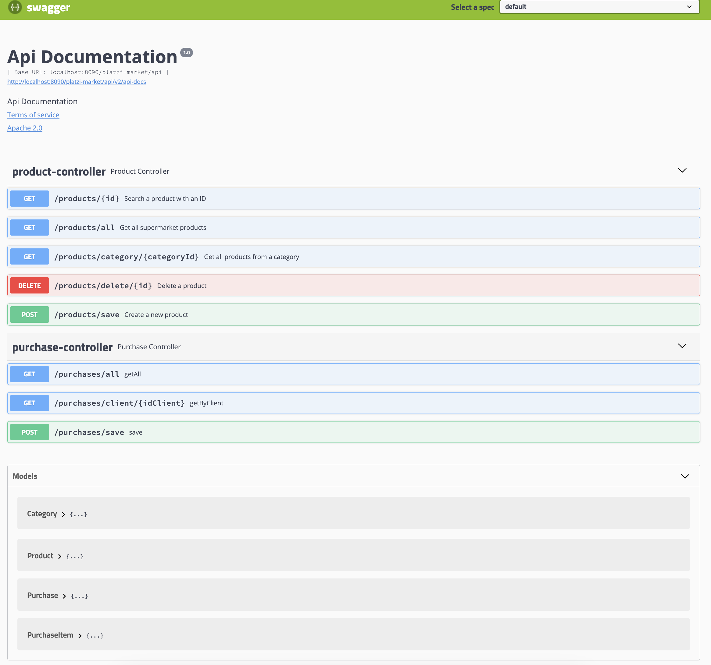

# Market Platform

## Introduction
Market Platform is a comprehensive e-commerce platform designed to facilitate the buying and selling of products. It leverages modern technologies to provide a seamless and efficient shopping experience for users and an easy management interface for sellers.

## Purpose
The primary purpose of Market Platform is to democratize access to e-commerce, enabling small to medium-sized businesses to reach their customers online. It aims to simplify the process of listing, selling, and managing products while providing customers with a wide range of products to choose from.

## Project Architecture

### Layers
The project is structured into several layers, each responsible for a specific aspect of the application:

- **Domain Layer**: Defines the core business logic and entities. It is the central layer that dictates the business rules of the application.
- **Persistence Layer**: Handles all database operations, including CRUD operations and queries. It acts as a bridge between the domain layer and the database.
- **Service Layer**: Contains business logic that is more about application operation than domain logic. It acts as a mediator between the controllers and the persistence layer.
- **Controller Layer**: Responsible for handling incoming HTTP requests and responding to the client. It maps the requests to the appropriate services.
- **Web Layer**: Contains configurations and utilities for web operations, including security and API documentation.

### Libraries and Frameworks Used
- **Spring Boot**: Simplifies the setup and development of new Spring applications.
- **Spring Data JPA**: Provides easy integration with JPA to offer advanced ORM capabilities.
- **Spring Web MVC**: Allows the creation of web applications or RESTful services using the Model-View-Controller pattern.
- **MapStruct**: Facilitates the mapping of DTOs to entity objects and vice versa.
- **PostgreSQL JDBC Driver**: Enables the application to connect to the PostgreSQL database.
- **Swagger**: Used for API documentation and testing.
- **JUnit**: Provides a powerful framework for writing and running repeatable tests.
- **Kotlin Standard Library**: Enhances the Java-based project with Kotlin's syntactic sugar and functionalities.

## Swagger UI

|                                                                                                                                                                                                 |
|:---------------------------------------------------------------------------------------------------------------------------------------------------------------------------------------------------------------------------------------------------------------------:|
| *This image showcases the Swagger UI for the Market Platform API, providing a visual representation of the API's endpoints, models, and their respective operations. It serves as an interactive documentation that facilitates both development and testing phases.* |

## Getting Started
To get started with Market Platform, clone the repository, configure your database connection in `application.properties`, and run the application using Spring Boot. Detailed setup instructions and API usage examples are available in the project's documentation.

## Contributing
Contributions to Market Platform are welcome! Please refer to the CONTRIBUTING.md file for guidelines on how to contribute to this project.

## License
Market Platform is open-sourced software licensed under the MIT license.